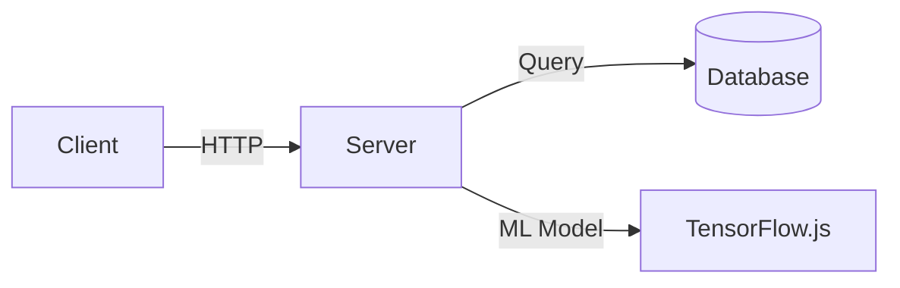
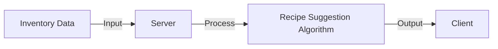
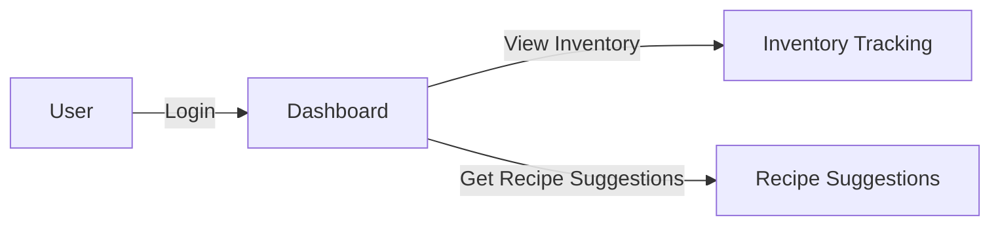

# BrewBuddy PRD: AI-Powered Coffee Shop Inventory Management and Recipe Suggestion System
## Elevator Pitch
BrewBuddy is an innovative application designed to revolutionize coffee shop inventory management and recipe discovery. By leveraging AI-powered predictive analytics and real-time inventory tracking, BrewBuddy empowers coffee shop owners and baristas to minimize waste, optimize stock levels, and create new revenue streams through personalized recipe suggestions.

## Executive Summary
BrewBuddy aims to transform the coffee shop experience by providing a comprehensive inventory management and recipe suggestion system. The application will utilize machine learning algorithms to predict inventory needs, suggest recipes based on available ingredients, and optimize stock levels. By streamlining inventory management and fostering creativity, BrewBuddy will help coffee shops reduce waste, increase sales, and improve customer satisfaction.

## Problem Landscape
The coffee shop industry faces significant challenges in managing inventory and minimizing waste. Current solutions often rely on manual tracking or generic inventory management systems that fail to account for the unique needs of coffee shops. This results in:

* Excess inventory and waste
* Lost sales due to stockouts
* Limited creativity in menu offerings
* Inefficient use of resources

## Market Analysis
The coffee shop market is a rapidly growing industry with a projected global value of $81.6 billion by 2025. The demand for specialty coffee is on the rise, driven by consumers seeking unique and high-quality coffee experiences. BrewBuddy is poised to capitalize on this trend by providing a tailored solution for coffee shops to optimize their inventory management and recipe discovery.

## Competitive Landscape
While there are existing inventory management solutions, they often lack the specificity and AI-powered predictive capabilities that BrewBuddy offers. Competitors in the coffee shop management space include:

* Generic inventory management systems
* Point-of-sale (POS) systems with limited inventory management features
* Specialty coffee shop management software with limited AI-powered capabilities

## Business Justification
BrewBuddy offers a compelling value proposition for coffee shops, enabling them to:

* Reduce waste and minimize excess inventory
* Increase sales through personalized recipe suggestions
* Improve customer satisfaction through creative menu offerings
* Optimize resource allocation and streamline operations

## User Personas
### Coffee Shop Owner
* Name: Alex
* Age: 35-50
* Responsibilities: Managing inventory, staff, and finances
* Pain Points: Excess inventory, waste, and lost sales due to stockouts
* Goals: Optimize inventory management, reduce waste, and increase sales

### Barista
* Name: Maya
* Age: 20-40
* Responsibilities: Preparing drinks, managing inventory, and providing customer service
* Pain Points: Limited creativity in menu offerings, difficulty managing inventory
* Goals: Create new drinks, reduce waste, and improve customer satisfaction

### Inventory Manager
* Name: Jamie
* Age: 25-45
* Responsibilities: Managing inventory, tracking stock levels, and ordering supplies
* Pain Points: Manual tracking, inaccurate inventory levels, and stockouts
* Goals: Streamline inventory management, reduce errors, and optimize stock levels

## Solution Architecture
BrewBuddy will be built using a microservices architecture, comprising:

* **Frontend**: Vite React application with Tailwind CSS for styling
* **Backend**: Node.js server handling API requests, database interactions, and machine learning model integration
* **Database**: PostgreSQL database storing inventory data, recipe information, and user data
* **Machine Learning Model**: TensorFlow.js model for predicting inventory needs and suggesting recipes

### Technical Specifications
* Frontend: Vite React, Tailwind CSS
* Backend: Node.js, PostgreSQL
* Machine Learning: TensorFlow.js
* APIs: RESTful APIs for inventory management, recipe suggestion, and user authentication

## Feature Specifications
### Inventory Tracking
* Real-time tracking of coffee shop inventory
* Automatic updates to inventory levels based on sales and stock movements
* Alerts for low stock levels and stockouts

### Recipe Suggestion
* AI-powered suggestions for new coffee recipes based on available ingredients
* Filtering and sorting options for recipe suggestions
* Integration with inventory management to ensure recipe feasibility

### Predictive Inventory Management
* Machine learning-based predictions for future inventory needs
* Alerts for potential stockouts and overstocking
* Recommendations for optimal stock levels

### User Authentication
* Secure login system for coffee shop staff
* Role-based access control for owners, baristas, and inventory managers

## User Stories
1. As a coffee shop owner, I want to track my inventory in real-time so that I can minimize waste and optimize my stock levels.
2. As a barista, I want to receive recipe suggestions based on available ingredients so that I can create new drinks and reduce waste.
3. As an inventory manager, I want to receive alerts for low stock levels and stockouts so that I can restock and avoid lost sales.

## Implementation Tasks
1. Set up Vite React project with Tailwind CSS
2. Design and implement inventory tracking feature
3. Develop recipe suggestion algorithm using TensorFlow.js
4. Implement user authentication
5. Integrate PostgreSQL database for data storage
6. Test and deploy application

### Phase1: Setup and Inventory Tracking (2 days)
* Set up project structure
* Implement inventory tracking feature

### Phase2: Recipe Suggestion and ML Integration (2 days)
* Develop recipe suggestion algorithm
* Integrate TensorFlow.js for machine learning

### Phase3: Testing and Deployment (1 day)
* Test application thoroughly
* Deploy to production environment

### Phase4: Final Touches (1 day)
* Implement user authentication
* Finalize UI/UX
* Prepare for launch

## Implementation Plan (1 week)
1. Day1-2: Setup and inventory tracking feature development
2. Day3-4: Recipe suggestion algorithm development and ML integration
3. Day5: Testing and deployment
4. Day6-7: Final touches and launch preparation

## System Components
1. **Frontend**: Vite React application with Tailwind CSS for styling
2. **Backend**: Node.js server handling API requests and database interactions
3. **Database**: PostgreSQL database storing inventory data and recipe information
4. **Machine Learning Model**: TensorFlow.js model for predicting inventory needs and suggesting recipes

## Diagrams
### Application Architecture


### Data Flow


### User Interaction Flow


## Code Snippets
### Recipe Suggestion Algorithm
```javascript
// Using TensorFlow.js for recipe suggestion
async function suggestRecipes(inventory) {
  const model = await tf.loadLayersModel('model.json');
  const input = tf.tensor2d(inventory, [1, inventory.length]);
  const prediction = model.predict(input);
  const recipes = await getRecipesFromPrediction(prediction);
  return recipes;
}

// Helper function to retrieve recipes from prediction
async function getRecipesFromPrediction(prediction) {
  const recipeIds = prediction.arraySync()[0];
  const recipes = await fetch(`/api/recipes?ids=${recipeIds.join(',')}`);
  return recipes.json();
}
```

### Inventory Tracking
```javascript
// Real-time inventory tracking using React state
import { useState, useEffect } from 'react';

function InventoryTracker() {
  const [inventory, setInventory] = useState([]);

  useEffect(() => {
    fetch('/api/inventory')
      .then(response => response.json())
      .then(data => setInventory(data));
  }, []);

  return (
    <div>
      {inventory.map(item => (
        <div key={item.id}>{item.name}: {item.quantity}</div>
      ))}
    </div>
  );
}
```

## Edge Cases and Risk Assessments
* Handling inventory discrepancies and stock adjustments
* Managing recipe suggestions for low-stock or out-of-stock ingredients
* Ensuring data security and user authentication

## Mitigation Strategies
* Implementing robust error handling and logging mechanisms
* Conducting regular software updates and maintenance
* Providing comprehensive user training and support

## Success Metrics
* Reduction in waste and excess inventory
* Increase in sales through personalized recipe suggestions
* Improvement in customer satisfaction through creative menu offerings

## Resource Requirements
* Development team: 2-3 developers, 1 designer
* Infrastructure: Cloud hosting, PostgreSQL database
* Timeline: 1 week for initial development, ongoing maintenance and updates

## Future Roadmap
* Integration with supplier APIs for automated ordering
* Advanced analytics for sales forecasting
* Expansion to other industries (e.g., restaurants, bakeries)

By following this comprehensive PRD, the BrewBuddy development team will be well-equipped to deliver a high-quality, AI-powered coffee shop inventory management and recipe suggestion system that meets the needs of coffee shop owners, baristas, and inventory managers.